# VXUI React CSS 架构与模块耦合度优化建议

## 一、CSS 架构审查

### 1.1 当前 CSS 文件结构

```
src/styles/
├── tokens.css          # 设计令牌（CSS 自定义属性）
├── reset.css           # CSS Reset
├── base.css            # 基础样式 + 所有组件样式（9526 行！）
├── layout.css          # 布局组件（Shell/Sidebar/Topbar）
├── mobile.css          # 移动端组件
└── components/
    ├── badge.css
    ├── button.css
    ├── card.css
    ├── data-display.css  # 巨型文件，包含 Avatar/Table/Breadcrumb/Pagination/Accordion/Spinner/Progress/Alert/Skeleton/Typography 等
    ├── dialog.css
    ├── form.css           # 巨型文件，包含 Checkbox/Radio/Textarea/Slider/Select/MultiSelect/Calendar/DatePicker/TimePicker/FileUpload 等
    ├── input.css
    ├── overlay.css        # 巨型文件，包含 Tooltip/Popover/DropdownMenu/ContextMenu/HoverCard/Menubar/NavigationMenu
    ├── switch.css
    ├── tabs.css
    └── toast.css
```

### 1.2 关键问题

#### 问题 1：`base.css` 与组件 CSS 文件严重重复

[`base.css`](src/styles/base.css)（9526 行）和 [`components/`](src/styles/components/) 目录下的文件存在大量完全重复的 CSS 规则。例如：

- `.vx-button` 及其所有变体（solid/secondary/ghost/outline/soft/danger 等）同时在 `base.css` 和 [`button.css`](src/styles/components/button.css) 中定义
- `.vx-card` 及其变体同时在 `base.css` 和 [`card.css`](src/styles/components/card.css) 中定义
- `.vx-input` 及其变体同时在 `base.css` 和 [`input.css`](src/styles/components/input.css) 中定义
- `.vx-dialog__*` 同时在 `base.css` 和 [`dialog.css`](src/styles/components/dialog.css) 中定义
- `.vx-tabs__*` 和 `.vx-segmented-control__*` 同时在 `base.css` 和 [`tabs.css`](src/styles/components/tabs.css) 中定义
- `.vx-switch__*` 同时在 `base.css` 和 [`switch.css`](src/styles/components/switch.css) 中定义
- `.vx-badge` 同时在 `base.css` 和 [`badge.css`](src/styles/components/badge.css) 中定义
- `.vx-toast__*` 同时在 `base.css` 和 [`toast.css`](src/styles/components/toast.css) 中定义
- Shell/Sidebar/Topbar 布局样式同时在 `base.css` 和 [`layout.css`](src/styles/layout.css) 中定义

**影响**：CSS 文件体积翻倍，浏览器需要解析重复规则，增加维护成本。

#### 问题 2：`data-display.css` 和 `form.css` 和 `overlay.css` 是巨型文件

- [`data-display.css`](src/styles/components/data-display.css) 包含 15+ 组件的样式
- [`form.css`](src/styles/components/form.css) 包含 12+ 组件的样式
- [`overlay.css`](src/styles/components/overlay.css) 包含 7+ 组件的样式

**影响**：违背了"一个组件一个 CSS 文件"的最佳实践，不利于按需加载和 tree-shaking。

#### 问题 3：`tokens.css` 与 `base.css` 中的 `:root` 变量定义重复

[`tokens.css`](src/styles/tokens.css) 和 [`base.css`](src/styles/base.css) 都定义了相同的 `:root` CSS 自定义属性。`base.css` 通过 `@import` 引入了 `tokens.css`，但自身又重复定义了所有 token。

#### 问题 4：CSS 导入链不清晰

查看 [`src/lib/index.ts`](src/lib/index.ts) 第 1 行：
```ts
import '../styles/base.css';
```

这意味着整个应用只通过一个入口导入 CSS。但 `base.css` 内部是否导入了其他 CSS 文件？如果所有 CSS 都通过一个文件加载，那 `components/` 目录下的独立 CSS 文件实际上没有被使用。

### 1.3 推荐方案

**方案 A（推荐）：清理重复，保持单文件入口**

1. 将 `base.css` 精简为仅包含 `@import` 语句和全局样式（reset + 基础排版）
2. 将组件样式从 `base.css` 中移除，只保留在各自的 `components/*.css` 文件中
3. 在 `base.css` 中通过 `@import` 按需引入各组件 CSS
4. 将 `data-display.css`、`form.css`、`overlay.css` 拆分为每个组件独立的 CSS 文件

**方案 B（更激进）：CSS Modules / CSS-in-JS**

如果项目考虑未来的按需加载，可以逐步迁移到 CSS Modules 或使用 `style-inject` 方案，但考虑到现有架构，方案 A 更务实。

---

## 二、CSS 设计系统一致性审查

### 2.1 做得好的地方

- **设计令牌体系完整**：`--vx-*` 变量覆盖了颜色、间距、阴影、圆角、字体、z-index、控制组件尺寸等所有维度
- **控制组件尺寸统一**：`--vx-ctrl-h-*` / `--vx-ctrl-px-*` / `--vx-ctrl-fs-*` 被 Button、Input、Select、DatePicker 等一致使用
- **主题系统完善**：`ThemeProvider` 支持 light/dark 模式 + 自定义主题，通过 `data-theme` 和 `data-theme-name` 属性切换
- **Glass 效果体系**：`--vx-glass-*` 系列变量统一管理毛玻璃效果
- **响应式断点**：`--vx-breakpoint-*` 与 JS 端 `viewport.tsx` 保持一致

### 2.2 存在的问题

#### 问题 5：部分组件使用硬编码颜色而非设计令牌

在 [`data-display.css`](src/styles/components/data-display.css) 中：

```css
.vx-alert--info    { background: color-mix(in srgb,#3b82f6 10%,transparent); border-color: color-mix(in srgb,#3b82f6 30%,transparent); color: #2563eb; }
.vx-alert--success { background: color-mix(in srgb,#22c55e 10%,transparent); border-color: color-mix(in srgb,#22c55e 30%,transparent); color: #16a34a; }
.vx-alert--warning { background: color-mix(in srgb,#f59e0b 10%,transparent); border-color: color-mix(in srgb,#f59e0b 30%,transparent); color: #d97706; }
.vx-alert--danger  { background: color-mix(in srgb,#ef4444 10%,transparent); border-color: color-mix(in srgb,#ef4444 30%,transparent); color: #dc2626; }
```

应使用 `var(--vx-info)`、`var(--vx-success)`、`var(--vx-warning)`、`var(--vx-danger)`。

同样的问题在：
- `.vx-progress--success / --warning / --danger` 使用硬编码 `#22c55e`、`#f59e0b`、`#ef4444`
- `.vx-dropdown__item--danger` 使用硬编码 `#ef4444`
- `.vx-dropdown__item--danger:hover` 使用硬编码 `#ef4444`

#### 问题 6：部分组件未使用 `--vx-ctrl-*` 尺寸令牌

- [`form.css`](src/styles/components/form.css) 中的 `.vx-textarea` 使用 `0.875rem` 而非 `var(--vx-ctrl-fs-md)`
- `.vx-select__option` 使用 `14px` 而非 `var(--vx-ctrl-fs-md)`
- `.vx-multiselect__tag` 使用 `12px` 而非 `var(--vx-ctrl-fs-sm)`

#### 问题 7：`rem` 和 `px` 混用

部分组件使用 `rem`（如 `0.875rem`、`0.75rem`），部分使用 `px`（如 `14px`、`12px`）。建议统一使用 `px` 以保持与设计令牌一致，或统一使用 `rem` 以支持浏览器字体缩放。

#### 问题 8：`base.css` 中的主题特定样式与 `ThemeProvider` 逻辑重复

[`base.css`](src/styles/base.css) 中定义了 `:root[data-theme-name='indigo']`、`:root[data-theme-name='violet']` 等主题特定样式，但这些主题的 token 已经在 [`ThemeProvider.tsx`](src/components/ThemeProvider.tsx) 中通过 JS 动态设置了。这导致主题样式有两套来源，容易产生冲突。

---

## 三、模块耦合度审查

### 3.1 组件依赖关系分析

```
Select.tsx
├── cx (lib/cx.ts)
├── getDialogPopoverContext (lib/dialogPopover.ts)
├── useIsMobile (hooks/useIsMobile.ts)
├── Sheet (components/Sheet/index.ts)
│   ├── useSheetState (components/Sheet/useSheetState.ts)
│   └── SheetPanel (components/Sheet/SheetPanel.tsx)
└── lucide-react (外部依赖)

Dialog.tsx
├── cx (lib/cx.ts)
├── useScrollbarSync (hooks/useScrollbarSync.ts)
├── useDialogState (hooks/useDialogState.ts)
├── useFocusTrap (hooks/useFocusTrap.ts)
├── useBodyScrollLock (hooks/useBodyScrollLock.ts)
├── Button (components/Button.tsx)
└── lucide-react (外部依赖)
```

### 3.2 耦合度评估

| 组件 | 内部依赖数 | 耦合度 | 说明 |
|------|-----------|--------|------|
| Button | 1 (cx) | ✅ 低 | 纯展示组件，依赖极少 |
| Input | 1 (cx) | ✅ 低 | 纯展示组件 |
| Dialog | 6 (cx + 4 hooks + Button) | ⚠️ 中 | 依赖多个 hooks，但 hooks 是通用工具 |
| Select | 4 (cx + dialogPopover + useIsMobile + Sheet) | ⚠️ 中 | 依赖 Sheet 组件，形成组件间耦合 |
| Sheet | 2 (useSheetState + SheetPanel) | ✅ 低 | 内部拆分良好 |
| ThemeProvider | 0 | ✅ 低 | 无内部组件依赖 |

### 3.3 关键问题

#### 问题 9：Select 强依赖 Sheet 组件

[`Select.tsx`](src/components/Select.tsx) 第 7 行：
```ts
import { Sheet } from './Sheet';
```

Select 在移动端使用 Sheet 作为选择器面板。这导致：
- 使用 Select 时必须同时打包 Sheet
- Sheet 的 API 变更会影响 Select
- 无法单独使用 Select（不引入 Sheet）

**建议**：通过 props 或 context 注入移动端面板组件，或使用策略模式解耦。

#### 问题 10：Dialog 强依赖 Button 组件

[`Dialog.tsx`](src/components/Dialog.tsx) 第 22 行：
```ts
import { Button } from './Button';
```

Dialog 在默认 footer 中使用了 Button 组件。这导致：
- 使用 Dialog 时必须同时打包 Button
- 如果用户想自定义 footer，Button 仍然会被打包（tree-shaking 无法移除）

**建议**：将默认 footer 中的 Button 改为原生 `<button>` 样式，或通过 lazy import 动态加载。

#### 问题 11：`dialogPopover.ts` 通过 CSS 类名选择器耦合

[`dialogPopover.ts`](src/lib/dialogPopover.ts) 第 1 行：
```ts
const DIALOG_CONTENT_SELECTOR = '.vx-dialog__content';
```

通过硬编码 CSS 类名来查找 DOM 节点，这是一种脆弱的耦合方式。如果 Dialog 组件的 CSS 类名变更，此工具函数会静默失效。

**建议**：使用 React Context 传递 dialog content ref，而非 DOM 选择器。

#### 问题 12：`base.css` 中 Dialog 的 `:has()` 选择器与 Select/MultiSelect 等组件耦合

[`base.css`](src/styles/base.css) 第 1862-1871 行：
```css
.vx-dialog__content:has(
  .vx-select__dropdown,
  .vx-multiselect__dropdown,
  .vx-dropdown__menu,
  .vx-datepicker__popover,
  .vx-timepicker__popover,
  .vx-colorpicker__panel
) {
  overflow: visible;
}
```

Dialog 的 CSS 直接引用了其他组件的类名。如果这些组件的类名变更，Dialog 的样式会出问题。

---

## 四、优化建议汇总

### 优先级 P0（高影响，低风险）

| # | 建议 | 影响 |
|---|------|------|
| 1 | **清理 `base.css` 与组件 CSS 的重复**：将 `base.css` 中与 `components/*.css` 重复的样式移除，`base.css` 只保留全局样式和 `@import` | CSS 体积减少约 50%，消除维护歧义 |
| 2 | **拆分巨型 CSS 文件**：将 `data-display.css`、`form.css`、`overlay.css` 拆分为每个组件独立的 CSS 文件 | 提高可维护性，支持按需加载 |
| 3 | **修复硬编码颜色**：Alert、Progress、DropdownMenu 中使用 `var(--vx-*)` 替代硬编码颜色值 | 主题一致性，自定义主题生效 |

### 优先级 P1（中等影响）

| # | 建议 | 影响 |
|---|------|------|
| 4 | **Select 与 Sheet 解耦**：通过 props 注入移动端面板组件，或使用 render props 模式 | 降低组件间强依赖 |
| 5 | **Dialog 与 Button 解耦**：默认 footer 使用原生 `<button>` 样式，或通过 lazy load 引入 Button | 减少不必要的打包体积 |
| 6 | **`dialogPopover.ts` 改用 Context**：通过 React Context 传递 dialog content ref，替代 CSS 类名选择器 | 消除脆弱的 DOM 耦合 |
| 7 | **统一 `px`/`rem` 使用**：统一使用 `px` 以匹配设计令牌体系 | 样式一致性 |

### 优先级 P2（低影响，长期改进）

| # | 建议 | 影响 |
|---|------|------|
| 8 | **主题特定样式从 CSS 迁移到 JS**：将 `base.css` 中 `:root[data-theme-name='*']` 的样式迁移到 `ThemeProvider` 的 token 中 | 单一数据源，避免样式冲突 |
| 9 | **CSS 命名规范文档化**：为 `vx-`（桌面端）、`vxm-`（移动端）前缀建立明确的命名规范文档 | 团队协作一致性 |
| 10 | **考虑 CSS Modules 迁移**：长期规划中可考虑逐步迁移到 CSS Modules，实现真正的样式隔离 | 避免全局命名冲突 |

---

## 五、实施路线图

```mermaid
flowchart TD
    A[Phase 1: CSS 清理] --> A1[移除 base.css 中与组件 CSS 重复的样式]
    A --> A2[拆分 data-display.css → 独立文件]
    A --> A3[拆分 form.css → 独立文件]
    A --> A4[拆分 overlay.css → 独立文件]
    
    B[Phase 2: 设计令牌修复] --> B1[Alert 使用 var--vx-* 替代硬编码]
    B --> B2[Progress 使用 var--vx-* 替代硬编码]
    B --> B3[DropdownMenu 使用 var--vx-* 替代硬编码]
    B --> B4[统一 px/rem 使用]
    
    C[Phase 3: 模块解耦] --> C1[Select ↔ Sheet 解耦]
    C --> C2[Dialog ↔ Button 解耦]
    C --> C3[dialogPopover.ts 改用 Context]
    
    D[Phase 4: 长期优化] --> D1[主题样式迁移到 JS]
    D --> D2[CSS Modules 评估]
```



---

## 六、总结

VXUI React 的 CSS 架构整体设计良好，设计令牌体系完整，主题系统完善。主要问题集中在：

1. **CSS 文件组织**：`base.css` 与组件 CSS 文件严重重复，导致 CSS 体积翻倍
2. **巨型文件**：`data-display.css`、`form.css`、`overlay.css` 包含过多组件，应拆分
3. **硬编码颜色**：部分组件未使用设计令牌，影响主题一致性
4. **模块耦合**：Select ↔ Sheet、Dialog ↔ Button 存在不必要的强依赖
5. **脆弱的 DOM 耦合**：`dialogPopover.ts` 通过 CSS 类名选择器查找 DOM 节点

建议优先处理 P0 项（CSS 清理和硬编码颜色修复），这些改动风险低、收益高。
