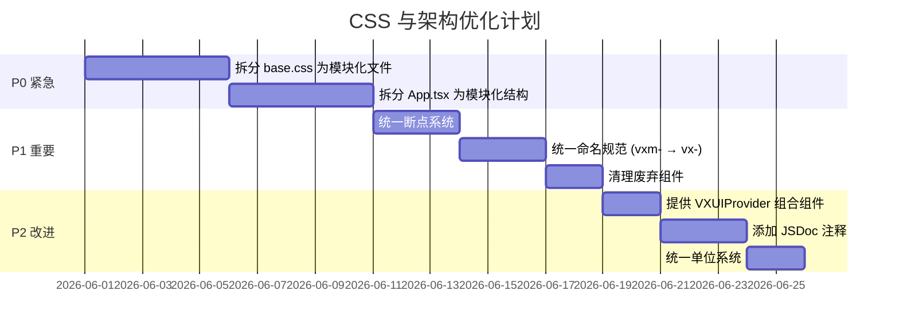

# VXUI React CSS 与程序架构审查报告

> 审查日期: 2026-05-30
> 审查范围: CSS 架构、组件架构、项目结构、代码组织

---

## 目录

1. [CSS 架构评估](#1-css-架构评估)
2. [程序架构评估](#2-程序架构评估)
3. [关键发现与改进建议](#3-关键发现与改进建议)
4. [行动计划](#4-行动计划)

---

## 1. CSS 架构评估

### 1.1 CSS 变量系统 — ⭐⭐⭐⭐⭐ (优秀)

**设计令牌体系** 非常完善，覆盖了以下维度：

| 类别 | 变量示例 | 说明 |
|------|---------|------|
| 语义色 | `--vx-primary`, `--vx-primary-strong`, `--vx-primary-soft` | 三层色彩层次 |
| 背景层级 | `--vx-bg`, `--vx-bg-accent`, `--vx-surface`, `--vx-surface-strong` | 4 层背景区分 |
| 文字层级 | `--vx-text`, `--vx-text-secondary`, `--vx-text-muted` | 3 层文字权重 |
| 控件尺寸 | `--vx-ctrl-h-sm/md/lg`, `--vx-ctrl-px-*`, `--vx-ctrl-fs-*` | 统一控件尺寸系统 |
| 阴影系统 | `--vx-shadow-sm`, `--vx-shadow`, `--vx-shadow-lg` | 3 层阴影深度 |
| 玻璃态 | `--vx-glass-bg`, `--vx-glass-filter`, `--vx-glass-highlight` | 完整毛玻璃效果 |
| Z-index | `--vx-z-layout(10)` → `--vx-z-toast(720)` | 清晰的层级栈 |
| 圆角 | `--vx-radius-sm(8px)` → `--vx-radius-xl(20px)` | 4 级圆角系统 |
| 布局 | `--vx-sidebar-width`, `--vx-header-height`, `--vx-content-width` | 布局常量 |

**亮点**:
- 使用 `color-mix()` 动态派生颜色，减少硬编码
- 控件尺寸变量被 [`Button`](src/components/Button.tsx:22)、[`Input`](src/styles/base.css:1555) 等组件统一引用，保证一致性
- 主题切换通过 `data-theme` + `data-theme-name` 双属性控制，灵活度高

### 1.2 主题机制 — ⭐⭐⭐⭐⭐ (优秀)

[`ThemeProvider`](src/components/ThemeProvider.tsx) 实现了完整的主题系统：

- **核心主题**: light / dark 基础主题
- **预设主题**: 10 个预设主题（Indigo, Violet, Mint, Graphite, Ocean, Black Gold, Ivory Gold, VXAI 等）
- **自定义主题**: 通过 `createTheme()` API 支持用户自定义
- **持久化**: 主题选择存储在 `localStorage` 中
- **运行时切换**: 通过 CSS 变量覆盖实现，无需重新加载

**主题定义示例**:
```typescript
const themePresets = {
  sunset: createTheme('light', {
    tokens: {
      '--vx-primary': '#c2410c',
      '--vx-bg': '#fff7ed',
      // ...
    },
  }),
};
```

### 1.3 CSS 命名规范 — ⭐⭐⭐⭐ (良好)

采用 BEM 风格命名：

```css
.vx-button              /* Block */
.vx-button--solid       /* Modifier (variant) */
.vx-button--sm          /* Modifier (size) */
.vx-button__spinner     /* Element */
```

**优点**:
- 一致的 `vx-` 前缀，避免全局污染
- BEM 风格的 modifier (`--`) 和 element (`__`)
- 组件级作用域

**问题**:
- 移动端组件使用 `vxm-` 前缀（如 `vxm-shell`, `vxm-bottomnav`），与桌面端 `vx-` 前缀不一致
- 部分组件（如 Checkbox, Radio, Textarea）使用 `rem` 单位，而其他组件使用 `px`，单位不统一

### 1.4 响应式设计 — ⭐⭐⭐ (需要改进)

**当前断点定义**:

| 来源 | sm | md | lg |
|------|----|----|-----|
| CSS 变量 | 640px | 768px | 1000px |
| JS breakpoints.ts | 640 | 768 | 1000 |

**问题 1: CSS 断点与 JS 设备检测逻辑不一致**

CSS 中使用 `@media (max-width: 640px)` 作为移动端断点，但 JS 中的 [`PHONE_MAX_WIDTH = 1000`](src/lib/breakpoints.ts:20)。这意味着：

- CSS 认为 640px 以上是桌面布局
- JS 认为 1000px 以下可能是手机/平板
- 在 641px ~ 1000px 范围内，CSS 渲染桌面样式，但 JS 可能触发移动端逻辑

**问题 2: 响应式断点分散**

CSS 中的媒体查询分散在整个 [`base.css`](src/styles/base.css) 中（9534 行），没有集中管理：
- `@media (max-width: 640px)` — 移动端适配
- `@media (max-width: 768px)` — 平板适配
- `@media (max-width: 1160px)` — 文档页面适配

**问题 3: `Responsive` 组件与 CSS 断点脱节**

[`Responsive`](src/components/Responsive.tsx) 组件使用 `useViewport()` 的 JS 检测结果，而 CSS 使用媒体查询。两者可能不同步。

### 1.5 CSS 文件大小 — ⚠️ 严重问题

[`base.css`](src/styles/base.css) 当前 **9534 行**，单个文件包含：
- 变量定义 (~94 行)
- 主题变量覆盖 (~60 行)
- 主题特定样式 (~300 行)
- Shell/Sidebar/Topbar 布局 (~350 行)
- 所有组件样式 (Button, Input, Dialog, Toast, Checkbox, Radio, Slider, etc.)
- 移动端组件样式 (MobileShell, BottomNav, ActionSheet, BottomSheet, MobileDrawer, etc.)
- 多个主题覆盖 (ivory-gold, black-gold, indigo, violet 等)
- 动画关键帧
- 响应式媒体查询

**问题**: 单个 9500+ 行的 CSS 文件难以维护，任何组件样式修改都需要在这个巨型文件中定位。

---

## 2. 程序架构评估

### 2.1 组件分层架构 — ⭐⭐⭐⭐⭐ (优秀)

```
src/
├── lib/                    # 工具函数和上下文
│   ├── index.ts            # 统一导出入口
│   ├── breakpoints.ts      # 断点常量
│   ├── viewport.tsx        # ViewportProvider + useViewport
│   ├── cx.ts               # className 合并工具
│   ├── dialogPopover.ts    # Dialog 内 Popover 定位
│   └── version.ts          # 版本号
├── hooks/                  # 可复用状态逻辑
│   ├── useIsMobile.ts
│   ├── useFocusTrap.ts
│   ├── useDialogState.ts
│   ├── useBodyScrollLock.ts
│   ├── useDropDirection.ts
│   └── useScrollbarSync.ts
├── components/             # UI 组件
│   ├── Shell.tsx           # 布局原语
│   ├── AppShell.tsx        # 高级布局封装
│   ├── Button.tsx          # 按钮
│   ├── Dialog.tsx          # 弹窗
│   ├── ... (60+ 组件)
│   ├── mobile/             # 移动端组件
│   │   ├── MobileShell.tsx
│   │   ├── BottomNav.tsx
│   │   ├── ActionSheet.tsx
│   │   └── ...
│   ├── pages/              # 页面组件
│   │   ├── HomePage.tsx
│   │   ├── LoginPage.tsx
│   │   └── ...
│   └── Sheet/              # Sheet 组件（多文件）
│       ├── index.ts
│       ├── Sheet.tsx
│       ├── SheetPanel.tsx
│       └── useSheetState.ts
├── i18n/                   # 国际化
│   └── index.tsx
├── styles/                 # 样式
│   └── base.css
├── App.tsx                 # 应用入口 (4860 行)
└── main.tsx                # 渲染入口
```

**优点**:
- 清晰的职责分离：`lib/` → `hooks/` → `components/`
- 统一的导出入口 [`lib/index.ts`](src/lib/index.ts)
- 支持 tree-shaking 的按需导出
- 类型定义同步导出

### 2.2 组件实现模式 — ⭐⭐⭐⭐ (良好)

**Button 组件示例** ([`Button.tsx`](src/components/Button.tsx)):
```typescript
export const Button = forwardRef<HTMLButtonElement, ButtonProps>(function Button(
  { className, variant = 'solid', size = 'md', ...props }, ref
) {
  return (
    <button
      ref={ref}
      className={cx('vx-button', `vx-button--${variant}`, className)}
      {...props}
    />
  );
});
```

**优点**:
- 使用 `forwardRef` 支持 ref 转发
- 使用 `cx()` 工具函数合并 className
- CSS 类名与 BEM 命名一致

**问题**:
- 部分组件（如 Checkbox, Radio）使用原生 `<input>` 而非 Radix UI 原语，可访问性可能不足
- 组件 Props 类型定义分散，部分组件缺少 JSDoc 注释

### 2.3 移动端适配 — ⭐⭐⭐ (需要改进)

**当前方案**:
- 使用 [`useViewport()`](src/lib/viewport.tsx) 基于物理屏幕尺寸检测设备类型
- [`Responsive`](src/components/Responsive.tsx) 组件根据 viewport 切换桌面/移动端渲染
- 独立的移动端组件（`MobileShell`, `BottomNav`, `MobileList` 等）

**问题 1: 桌面/移动端组件重复**

存在两套并行的组件体系：
- 桌面端: `Shell` → `AppShell`
- 移动端: `MobileShell` → `MobileApp`

这导致：
- 维护成本翻倍
- 行为不一致的风险
- 新功能需要在两套组件中分别实现

**问题 2: 移动端组件命名不一致**

- 桌面端: `vx-shell`, `vx-sidebar`, `vx-topbar`
- 移动端: `vxm-shell`, `vxm-topbar`, `vxm-bottomnav`

`vxm-` 前缀与 `vx-` 体系不一致。

**问题 3: 废弃组件未清理**

[`lib/index.ts`](src/lib/index.ts:154-158) 中标记了 `@deprecated` 的组件：
- `ActionSheet` — 被统一 `Sheet` 替代
- `MobileDrawer` — 被统一 `Sheet` 替代
- `BottomSheet` — 被统一 `Sheet` 替代

但仍保留在导出中，增加了包体积和维护负担。

### 2.4 状态管理 — ⭐⭐⭐⭐ (良好)

**Context 体系**:
- [`ThemeProvider`](src/components/ThemeProvider.tsx) — 主题状态
- [`ViewportProvider`](src/lib/viewport.tsx) — 视口状态
- [`I18nProvider`](src/i18n/index.tsx) — 国际化状态
- [`ToastProvider`](src/components/Toast.tsx) — Toast 通知

**问题**: 多个 Provider 需要手动嵌套，缺少统一的 Provider 组合机制。

### 2.5 应用入口文件大小 — ⚠️ 严重问题

[`App.tsx`](src/App.tsx) 当前 **4860 行**，包含：
- 38 个 icon 导入
- 大量组件导入
- 文档页面配置数据
- 路由解析逻辑
- 页面渲染逻辑
- 代码示例片段

**问题**: 单个 4860 行的文件极难维护，应拆分为多个模块。

### 2.6 国际化 — ⭐⭐⭐⭐ (良好)

[`i18n/index.tsx`](src/i18n/index.tsx) 实现了完整的国际化支持：
- 中英文双语
- 类型安全的翻译键
- 与组件深度集成

---

## 3. 关键发现与改进建议

### 优先级: P0 (严重问题)

#### P0-1: CSS 文件拆分

**问题**: [`base.css`](src/styles/base.css) 9534 行，单个巨型文件。

**建议**: 按模块拆分：
```
src/styles/
├── tokens.css              # CSS 变量定义 (~100 行)
├── reset.css               # 浏览器重置 (~80 行)
├── layout.css              # Shell/Sidebar/Topbar (~300 行)
├── components/
│   ├── button.css
│   ├── input.css
│   ├── dialog.css
│   ├── toast.css
│   ├── card.css
│   ├── tabs.css
│   ├── switch.css
│   └── ... (每个组件独立文件)
├── mobile.css              # 移动端组件样式
└── themes/
    ├── indigo.css
    ├── violet.css
    ├── ivory-gold.css
    └── ... (每个主题独立文件)
```

**注意**: 拆分后需要通过构建工具（如 Vite 的 `@import` 或 PostCSS）合并，确保最终产出一个 CSS 文件。

#### P0-2: App.tsx 拆分

**问题**: [`App.tsx`](src/App.tsx) 4860 行。

**建议**: 拆分为：
```
src/
├── app/
│   ├── routes.ts           # 路由配置
│   ├── nav-config.ts       # 导航配置
│   ├── doc-snippets/       # 文档代码示例
│   │   ├── button.ts
│   │   ├── dialog.ts
│   │   └── ...
│   ├── page-defs.ts        # 页面定义
│   └── DesktopApp.tsx      # 桌面端应用组件
├── App.tsx                 # 精简入口 (~50 行)
```

### 优先级: P1 (重要问题)

#### P1-1: 统一断点系统

**问题**: CSS 媒体查询断点与 JS 设备检测逻辑不一致。

**建议**:
1. 将 CSS 断点变量与 JS 常量统一：
   ```css
   :root {
     --vx-breakpoint-phone: 640px;   /* 手机 */
     --vx-breakpoint-tablet: 768px;  /* 平板 */
     --vx-breakpoint-desktop: 1000px; /* 桌面 */
   }
   ```
2. 在 CSS 中使用 `@media (max-width: 1000px)` 作为移动端布局断点，与 `PHONE_MAX_WIDTH` 保持一致
3. 或者明确区分"布局断点"和"设备检测断点"，添加文档说明

#### P1-2: 统一命名规范

**问题**: `vxm-` 前缀与 `vx-` 体系不一致。

**建议**:
- 将移动端组件 CSS 类名从 `vxm-*` 迁移到 `vx-mobile-*` 或 `vx-*`
- 或者保留 `vxm-` 但添加文档说明其含义

#### P1-3: 清理废弃组件

**问题**: 标记为 `@deprecated` 的组件仍保留在导出中。

**建议**:
- 在下一个 major 版本中移除 `ActionSheet`, `MobileDrawer`, `BottomSheet`
- 或者添加编译时警告

### 优先级: P2 (改进建议)

#### P2-1: 统一 Provider 组合

**问题**: 多个 Provider 需要手动嵌套。

**建议**: 提供 `VXUIProvider` 组合组件：
```tsx
export function VXUIProvider({ children, ...options }) {
  return (
    <ThemeProvider {...options.theme}>
      <ViewportProvider>
        <ToastProvider>
          {children}
        </ToastProvider>
      </ViewportProvider>
    </ThemeProvider>
  );
}
```

#### P2-2: 组件 Props 文档化

**问题**: 部分组件缺少 JSDoc 注释。

**建议**: 为所有公共组件的 Props 接口添加 JSDoc 注释。

#### P2-3: 统一单位系统

**问题**: 部分组件使用 `rem`，部分使用 `px`。

**建议**: 统一使用 `px` 或 `rem`，建议控件尺寸使用 `px`（精确控制），间距使用 `rem`（响应式缩放）。

---

## 4. 行动计划

### 阶段 1: 紧急修复 (P0)



### 详细任务列表

#### 任务 1: 拆分 base.css
- [ ] 创建 `src/styles/tokens.css` — 提取 CSS 变量定义
- [ ] 创建 `src/styles/reset.css` — 提取浏览器重置样式
- [ ] 创建 `src/styles/layout.css` — 提取 Shell/Sidebar/Topbar 布局
- [ ] 创建 `src/styles/components/` 目录 — 按组件拆分样式
- [ ] 创建 `src/styles/mobile.css` — 提取移动端组件样式
- [ ] 创建 `src/styles/themes/` 目录 — 按主题拆分覆盖样式
- [ ] 在 `lib/index.ts` 中通过 `@import` 或构建工具合并

#### 任务 2: 拆分 App.tsx
- [ ] 提取路由配置到 `src/app/routes.ts`
- [ ] 提取导航配置到 `src/app/nav-config.ts`
- [ ] 提取文档代码示例到 `src/app/doc-snippets/`
- [ ] 提取页面定义到 `src/app/page-defs.ts`
- [ ] 创建 `src/app/DesktopApp.tsx` 桌面端应用组件
- [ ] 精简 `App.tsx` 为入口文件

#### 任务 3: 统一断点系统
- [ ] 统一 CSS 媒体查询断点与 JS 常量
- [ ] 更新 `Responsive` 组件与 CSS 断点对齐
- [ ] 添加断点使用文档

#### 任务 4: 统一命名规范
- [ ] 将 `vxm-*` CSS 类名迁移为 `vx-mobile-*`
- [ ] 更新对应组件中的 className 引用

#### 任务 5: 清理废弃组件
- [ ] 移除 `ActionSheet` 导出
- [ ] 移除 `MobileDrawer` 导出
- [ ] 移除 `BottomSheet` 相关样式和组件
- [ ] 更新文档和迁移指南

---

## 总结

| 维度 | 评分 | 关键问题 |
|------|------|---------|
| CSS 变量系统 | ⭐⭐⭐⭐⭐ | 完善的设计令牌体系 |
| 主题机制 | ⭐⭐⭐⭐⭐ | 灵活的多主题支持 |
| CSS 命名规范 | ⭐⭐⭐⭐ | BEM 风格，`vxm-` 需统一 |
| 响应式设计 | ⭐⭐⭐ | 断点不一致，需对齐 |
| CSS 文件组织 | ⭐⭐ | 9534 行单文件，必须拆分 |
| 组件架构 | ⭐⭐⭐⭐⭐ | 清晰的分层设计 |
| 移动端适配 | ⭐⭐⭐ | 组件重复，需整合 |
| 状态管理 | ⭐⭐⭐⭐ | Context + Hooks，可组合优化 |
| 代码组织 | ⭐⭐ | App.tsx 4860 行，必须拆分 |
| 国际化 | ⭐⭐⭐⭐ | 完整的多语言支持 |

**总体评价**: 架构设计理念优秀，但代码组织需要重构以维持长期可维护性。
