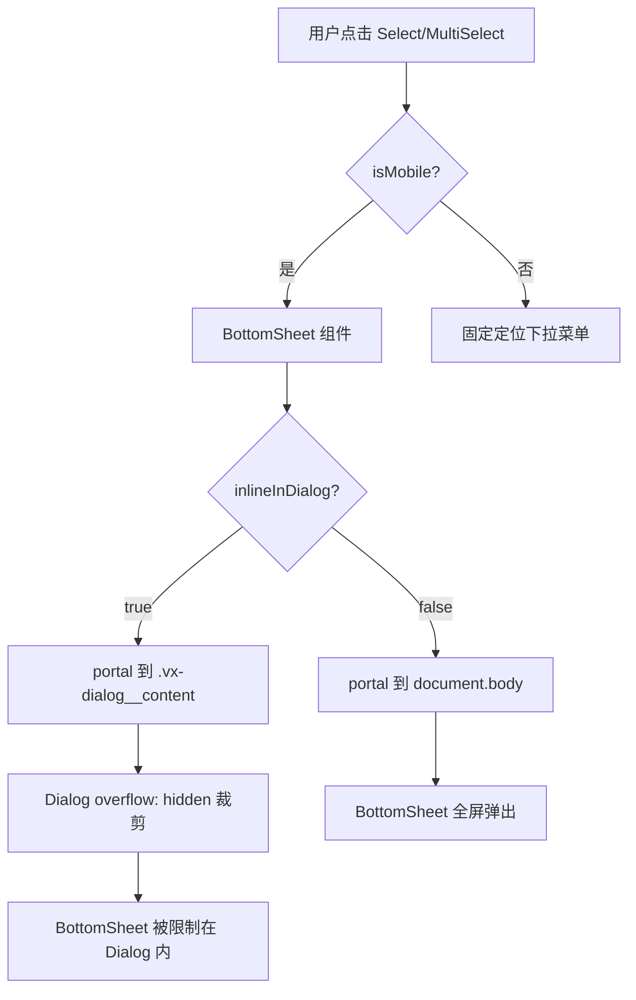

# 移动设备 BottomSheet 在所有 Dialog 场景中全屏弹出修复计划

## 问题描述

在移动设备上，当 Dialog（无论全屏还是非全屏）内部的下拉组件（`Select`、`MultiSelect`、`DatePicker`、`TimePicker`）触发 `BottomSheet` 弹出时，BottomSheet 被 portal 到 `.vx-dialog__content` 内部，被 Dialog 的 `overflow: hidden` 裁剪在 Dialog 的圆角容器内，而不是从屏幕最下方全屏弹出。

## 根因分析

### 渲染链路



### 关键代码路径

1. **组件触发** ([`Select.tsx:347`](src/components/Select.tsx:347)):
   ```tsx
   inlineInDialog={Boolean(getDialogPopoverContext(wrapRef.current).dialogContent)}
   ```

2. **Dialog 检测** ([`dialogPopover.ts:7-9`](src/lib/dialogPopover.ts:7-9)):
   ```ts
   export function getDialogContent(node: HTMLElement | null) {
     return node?.closest<HTMLElement>('.vx-dialog__content') ?? null;
   }
   ```

3. **BottomSheet 渲染** ([`BottomSheet.tsx:260-267`](src/components/mobile/BottomSheet.tsx:260-267)):
   ```tsx
   if (inlineInDialog) {
     const dialogContent = document.querySelector('.vx-dialog__content');
     if (dialogContent) {
       return createPortal(sheetContent, dialogContent);
     }
   }
   return createPortal(sheetContent, document.body);
   ```

### 问题核心

当组件在 Dialog 内部时，`getDialogContent` 返回 dialog 元素，`inlineInDialog` 为 `true`，BottomSheet 被 portal 到 `.vx-dialog__content` 内部。Dialog 的 `overflow: hidden` 样式（[`base.css:1776`](src/styles/base.css:1776)）将 BottomSheet 裁剪在 Dialog 边界内。

## 解决方案

### 方案：移动设备上 BottomSheet 始终渲染到 body

修改 [`BottomSheet.tsx`](src/components/mobile/BottomSheet.tsx:259-267) 的渲染逻辑：在移动设备上，忽略 `inlineInDialog` 属性，始终将 BottomSheet 渲染到 `document.body`。

**设计理由**：
1. BottomSheet 是移动设备的原生风格组件，应该从屏幕最下方全屏弹出
2. Dialog 的 `overflow: hidden` 会裁剪 BottomSheet，不符合预期
3. BottomSheet 的 z-index (`--vx-z-sheet-overlay: 600`) 高于 Dialog (`--vx-z-dialog: 510`)，应该覆盖 Dialog
4. 这与 [`dialogPopover.ts:22-23`](src/lib/dialogPopover.ts:22-23) 中的注释一致：
   ```ts
   // Always portal on desktop; BottomSheet on mobile handles its own portal logic
   ```

### 实现细节

#### 1. 修改 BottomSheet 渲染逻辑

在 [`BottomSheet.tsx`](src/components/mobile/BottomSheet.tsx:259-267) 中：

```tsx
// 如果需要在 Dialog 内渲染到 dialogContent 中
// 但在移动设备上，BottomSheet 应该始终从屏幕最下方全屏弹出
if (inlineInDialog && !isMobileDevice()) {
  const dialogContent = document.querySelector('.vx-dialog__content');
  if (dialogContent) {
    return createPortal(sheetContent, dialogContent);
  }
}

return createPortal(sheetContent, document.body);
```

其中 `isMobileDevice()` 可以通过以下方式检测：
- 使用 `window.innerWidth <= 1000` 作为简单检测
- 或者使用已有的 `useViewport` hook 中的逻辑

#### 2. 同步更新 body 滚动锁定

当前 BottomSheet 会锁定 body 滚动（[`BottomSheet.tsx:101-110`](src/components/mobile/BottomSheet.tsx:101-110)）：
```tsx
useEffect(() => {
  if (phase === 'entering' || phase === 'visible') {
    document.body.style.overflow = 'hidden';
  } else {
    document.body.style.overflow = '';
  }
  ...
}, [phase]);
```

当 BottomSheet 渲染到 body 且 Dialog 也打开时，body 滚动会被锁定两次。这不会导致问题，因为设置 `overflow: hidden` 是幂等操作。

#### 3. z-index 层级验证

当前 z-index 设置：
- `--vx-z-dialog-overlay: 500`
- `--vx-z-dialog: 510`
- `--vx-z-sheet-overlay: 600`

BottomSheet 的遮罩层使用 `--vx-z-sheet-overlay: 600`，高于 Dialog 的 `--vx-z-dialog: 510`，层级关系正确。

### 影响范围

| 组件 | 影响 | 说明 |
|------|------|------|
| [`BottomSheet.tsx`](src/components/mobile/BottomSheet.tsx) | 修改 | 添加移动设备检测，始终渲染到 body |
| [`Select.tsx`](src/components/Select.tsx) | 无影响 | 自动继承修复 |
| [`MultiSelect.tsx`](src/components/MultiSelect.tsx) | 无影响 | 自动继承修复 |
| [`DatePicker.tsx`](src/components/DatePicker.tsx) | 无影响 | 自动继承修复 |
| [`TimePicker.tsx`](src/components/TimePicker.tsx) | 无影响 | 自动继承修复 |
| [`dialogPopover.ts`](src/lib/dialogPopover.ts) | 无修改 | 现有逻辑已足够 |
| [`base.css`](src/styles/base.css) | 无修改 | 现有样式已足够 |

## 实施步骤

### Step 1: 修改 BottomSheet 组件

- 文件：[`src/components/mobile/BottomSheet.tsx`](src/components/mobile/BottomSheet.tsx)
- 修改位置：第 259-267 行（渲染逻辑部分）
- 变更：添加移动设备检测，在移动设备上始终渲染到 body

### Step 2: 验证测试

- 在移动设备模式下打开非全屏 Dialog
- 在移动设备模式下打开全屏 Dialog
- 测试 Select、MultiSelect、DatePicker、TimePicker 的 BottomSheet 弹出
- 确认 BottomSheet 从屏幕最下方全屏弹出
- 确认拖拽、关闭、确认按钮功能正常
- 确认 body 滚动锁定行为正常

## 替代方案对比

### 方案 A：修改 dialogPopover.ts（未采用）

在移动设备上让 `getDialogContent` 返回 `null`。

**缺点**：
- `dialogPopover.ts` 是纯函数，无法访问 `useIsMobile` hook
- 需要引入新的检测逻辑，增加耦合
- 影响所有使用 `getDialogContent` 的场景

### 方案 B：修改 Dialog overflow 样式（未采用）

在 Dialog 有打开的 BottomSheet 时变为 `overflow: visible`。

**缺点**：
- 需要额外的 CSS `:has()` 选择器检测 `.vxm-bottomsheet`
- 可能导致 Dialog 内容溢出到遮罩层下方
- 非全屏 Dialog 的 BottomSheet 仍然会被裁剪

### 方案 C：修改 BottomSheet 渲染逻辑（采用）

在移动设备上忽略 `inlineInDialog` 属性，始终渲染到 body。

**优点**：
- 精准控制，只在移动设备场景下生效
- 符合 BottomSheet 作为移动设备原生组件的设计预期
- 最小改动，只需修改一个文件
- 向后兼容，桌面端行为保持不变

## 决策理由

选择方案 C 的原因：
1. **符合设计预期**：BottomSheet 是移动设备的原生风格组件，应该从屏幕最下方全屏弹出
2. **最小改动**：只需修改一个文件，无 CSS 变更
3. **向后兼容**：桌面端行为保持不变
4. **与现有注释一致**：[`dialogPopover.ts:22`](src/lib/dialogPopover.ts:22) 中已有注释说明移动端应该始终 portal 到 body
