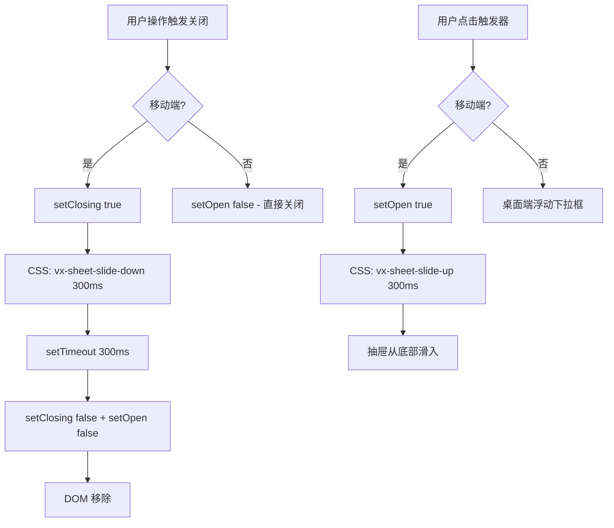

# 移动端底部抽屉统一动画方案（最终版）

## 问题

移动端（≤ 640px）下，Select/MultiSelect/DatePicker/TimePicker/ColorPicker 的下拉面板以底部抽屉形式展示，但：
1. **打开时无动画** — 瞬间出现
2. **关闭时无动画** — 瞬间消失（`setOpen(false)` 直接移除 DOM）
3. **z-index 不一致** — Dialog 内外使用不同值

## 目标

所有移动端底部抽屉统一行为：**上滑打开、下滑关闭**，z-index 始终最高，与调用者无关。

## 当前关闭机制分析

所有组件关闭都是直接 `setOpen(false)`：

```typescript
// Select.tsx / MultiSelect.tsx / DatePicker.tsx / TimePicker.tsx
const onOutside = (event: Event) => {
  if (!inWrap && !inDropdown) setOpen(false);  // 直接关闭，无动画
};
const onKey = (event: KeyboardEvent) => {
  if (event.key === 'Escape') { setOpen(false); }  // 直接关闭，无动画
};
```

ColorPicker 同理。

## 方案

### 核心思路

引入一个"关闭中"状态（`closing`），关闭时先设置 `closing = true` 触发下滑动画，动画结束后再真正移除 DOM（`setOpen(false)`）。

### 方案 A：CSS animation + JS 延迟（推荐）

在每个组件中添加关闭动画逻辑：

```typescript
const [closing, setClosing] = useState(false);

const close = () => {
  setClosing(true);
  // 等动画结束后再真正关闭
  setTimeout(() => {
    setClosing(false);
    setOpen(false);
  }, 300); // 与动画时长一致
};
```

CSS 中通过 `.vx-select__dropdown--closing` 类触发下滑动画：

```css
/* 打开：上滑 */
.vx-select__dropdown {
  animation: vx-sheet-slide-up 300ms cubic-bezier(0.32, 0.72, 0, 1) forwards;
}

/* 关闭：下滑 */
.vx-select__dropdown--closing {
  animation: vx-sheet-slide-down 300ms cubic-bezier(0.32, 0.72, 0, 1) forwards;
}

@keyframes vx-sheet-slide-up {
  from { transform: translateY(100%); }
  to   { transform: translateY(0); }
}

@keyframes vx-sheet-slide-down {
  from { transform: translateY(0); }
  to   { transform: translateY(100%); }
}
```

### 方案 B：创建通用 MobileSheet 组件（更彻底的重构）

创建一个 `MobileSheet` 组件封装所有抽屉行为（打开/关闭动画、遮罩、z-index），然后各组件在移动端使用它。

但这需要较大重构，且当前各组件内容结构差异大（Select 有搜索框+列表，DatePicker 有日历，TimePicker 有时间滚轮+Done 按钮），统一封装成本高。

### 推荐：方案 A

改动最小，效果统一，每个组件只需添加约 10 行 JS + 少量 CSS。

## 具体修改

### CSS 修改（[`base.css`](src/styles/base.css)）

**修改 1**：在移动端媒体查询中，统一所有底部抽屉的 z-index 和打开动画

```css
@media (max-width: 640px) {
  .vx-select__dropdown,
  .vx-multiselect__dropdown,
  .vx-timepicker__popover,
  .vx-datepicker__popover,
  .vx-colorpicker__panel {
    /* 现有样式保持不变 */
    z-index: var(--vx-z-toast);  /* 720 — 始终最高 */
    animation: vx-sheet-slide-up 300ms cubic-bezier(0.32, 0.72, 0, 1) forwards;
    will-change: transform;
  }

  /* 关闭动画 */
  .vx-select__dropdown--closing,
  .vx-multiselect__dropdown--closing,
  .vx-timepicker__popover--closing,
  .vx-datepicker__popover--closing,
  .vx-colorpicker__panel--closing {
    animation: vx-sheet-slide-down 300ms cubic-bezier(0.32, 0.72, 0, 1) forwards;
  }
}
```

**修改 2**：删除 `--in-dialog` 的特殊 z-index（不再需要）

**修改 3**：添加 `vx-sheet-slide-down` keyframes

```css
@keyframes vx-sheet-slide-down {
  from { transform: translateY(0); }
  to   { transform: translateY(100%); }
}
```

### JS 修改（5 个组件）

每个组件添加相同的关闭动画逻辑。以 Select 为例：

```typescript
// 新增状态
const [closing, setClosing] = useState(false);

// 统一的关闭函数（替代直接 setOpen(false)）
const closeWithAnimation = () => {
  setClosing(true);
  setTimeout(() => {
    setClosing(false);
    setOpen(false);
  }, 300);
};

// 所有关闭点改用 closeWithAnimation：
// - onOutside handler
// - Escape key handler
// - handleSelect（选中后关闭）
// - scroll/resize handler
```

下拉框节点添加 `--closing` 类：

```tsx
className={cx(
  'vx-select__dropdown',
  closing && 'vx-select__dropdown--closing',
  // ...
)}
```

### 影响范围

| 文件 | 改动 |
|------|------|
| [`base.css`](src/styles/base.css) | 修改 z-index、添加打开/关闭动画、删除 `--in-dialog` 规则、添加 `vx-sheet-slide-down` keyframes |
| [`Select.tsx`](src/components/Select.tsx) | 添加 `closing` 状态 + `closeWithAnimation` |
| [`MultiSelect.tsx`](src/components/MultiSelect.tsx) | 同上 |
| [`DatePicker.tsx`](src/components/DatePicker.tsx) | 同上 |
| [`TimePicker.tsx`](src/components/TimePicker.tsx) | 同上 |
| [`ColorPicker.tsx`](src/components/ColorPicker.tsx) | 同上 |

## 流程图



## 设计理由

| 决策 | 理由 |
|------|------|
| 所有 5 个组件统一动画 | 动画行为与调用者无关，只要是底部抽屉就统一 |
| `z-index: var(--vx-z-toast)` | 抽屉是最高优先级 UI，始终在最顶层 |
| 方案 A（CSS + JS 延迟） | 改动最小，不引入新组件，不破坏现有架构 |
| `cubic-bezier(0.32, 0.72, 0, 1)` | 与 ActionSheet/MobileDrawer 一致 |
| 300ms | 与 ActionSheet 一致，适合移动端手势感知 |
